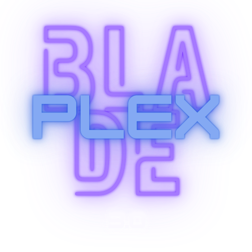

<p align="center">
  
</p>

<h1 align="center">BladePlex</h1>

<p align="center">
  A personalized media request and discovery experience built on
  <a href="https://github.com/seerr-team/seerr">Seerr</a>.
</p>

<p align="center">
  <a href="https://github.com/sbv29/bladeplex/actions/workflows/ci.yml"></a>
  <a href="https://github.com/sbv29/bladeplex/blob/main/LICENSE"></a>
</p>

**BladePlex** is a free and open source application for discovering media and managing requests for your library. It supports [Jellyfin](https://jellyfin.org), [Plex](https://plex.tv), and [Emby](https://emby.media/), and integrates with **[Sonarr](https://sonarr.tv/)** and **[Radarr](https://radarr.video/)**.

BladePlex builds on the excellent foundation provided by [Seerr](https://github.com/seerr-team/seerr), retaining its request-management features while adding a more personalized discovery experience and BladePlex-specific enhancements.

## Current Features

- Full Jellyfin, Emby, and Plex integration, including authentication, user import, and user management.
- Support for **PostgreSQL** and **SQLite** databases.
- Support for movie, TV, and mixed media libraries.
- Easy integration with Sonarr and Radarr.
- Jellyfin, Emby, and Plex library scans to track media that is already available.
- A customizable request system for movies and individual TV seasons.
- A straightforward request-management interface for approving and declining requests.
- Granular user permissions and request quotas.
- Support for numerous notification agents.
- Mobile-friendly layouts for discovering, requesting, and managing media on the go.
- Watchlist and blocklist support.
- Progressive Web App support for installation on compatible desktop and mobile devices.

## BladePlex Features

- **Native MDBList discovery:** Add public or official MDBList movie and TV lists as native Discover sliders with linked full-page grids.
- **Ranked, efficient list browsing:** MDBList ordering is preserved while results are hydrated through TMDb, paginated locally, and cached to reduce upstream requests.
- **IMDb ratings throughout the UI:** Movie and TV posters and detail pages display IMDb ratings backed by a persistent refreshable cache.
- **Community reactions:** Users can like or dislike movies and series and see community totals.
- **Expanded discovery:** Browse digital new releases, official streaming charts, and administrator-curated custom lists.
- **Customizable Discover experience:** Reorder or hide managed discovery sliders while retaining native BladePlex navigation and presentation.
- **Mobile announcements:** Administrators can publish dismissible, scheduled announcements above the mobile navigation.
- **Refined mobile details:** Improved action layouts, tags, issue reporting, and media-specific watchlist behavior on smaller screens.
- **Graphite visual design:** A darker BladePlex theme with refined Discover headings and branded browser/PWA presentation.
- **Configurable video links:** Use YouTube or a compatible self-hosted YouTube frontend for video links.
- **Deployment safeguards:** Production deployment scripts validate commit metadata and container health while preserving a rollback path.

More improvements are planned. Check the [issue tracker](/../../issues) for known issues and feature ideas.

## Getting Started

BladePlex follows Seerr's core deployment and configuration model. The upstream [Seerr documentation](https://docs.seerr.dev/getting-started/) is a useful reference for prerequisites, media-server setup, Sonarr/Radarr integration, permissions, and notifications.

Create a folder containing this `compose.yaml`:

```yaml
services:
  bladeplex:
    image: ghcr.io/sbv29/bladeplex:latest
    container_name: bladeplex
    ports:
      - '127.0.0.1:5059:5055'
    volumes:
      - bladeplex-config:/app/config
    restart: unless-stopped

volumes:
  bladeplex-config:
```

Start BladePlex:

```bash
docker compose pull
docker compose up --detach
```

BladePlex is then available at [http://localhost:5059](http://localhost:5059). The named `bladeplex-config` volume preserves settings and the database when the container is replaced.

### Updating

Pull the newest tested `main` image and let Compose replace the container:

```bash
docker compose pull
docker compose up --detach
```

Do not delete the `bladeplex-config` volume during an update. To install or roll back to an exact build, replace `latest` with a full Git commit SHA: `ghcr.io/sbv29/bladeplex:<full-commit-sha>`.

### Building from source

Published images are recommended for normal installations. Contributors and offline deployments can still build locally:

```bash
git clone https://github.com/sbv29/bladeplex.git
cd bladeplex
docker compose -f docker-compose.yml -f compose.build.yaml up --detach --build
```

The repository Compose configuration defaults to [http://localhost:5055](http://localhost:5055) and stores persistent data at `/opt/stacks/seerr/config`. Set `BLADEPLEX_HOST_PORT` and `BLADEPLEX_CONFIG_PATH` in a `.env` file when different values are required.

See [the BladePlex Docker guide](./docs/getting-started/bladeplex-docker.md) for Windows, Linux, upgrades, pinned versions, and production deployment.

## Preview

## Migrating from Overseerr/Jellyseerr to BladePlex

BladePlex inherits Seerr's migration support for Overseerr and Jellyseerr installations. Back up your existing configuration and database before migrating.

Read the upstream [Seerr release announcement](https://docs.seerr.dev/blog/seerr-release) for background, then follow the [migration guide](https://docs.seerr.dev/migration-guide) for detailed instructions. After migration, review BladePlex's General, Discover, and Custom Lists settings.

## Support

- Review the [Seerr documentation](https://docs.seerr.dev) for core installation and configuration guidance.
- Report BladePlex bugs or request BladePlex features through [GitHub Issues](/../../issues).
- Use [GitHub Discussions](/../../discussions) for BladePlex questions and ideas when Discussions are enabled for the repository.
- For upstream Seerr questions and community support, visit the [Seerr Discord server](https://discord.gg/seerr).

When reporting a problem, include your BladePlex commit tag, deployment method, relevant logs, and clear reproduction steps. Never include API keys or access tokens.

## API Documentation

Interactive API documentation is available from a running BladePlex installation at [http://localhost:5055/api-docs](http://localhost:5055/api-docs).

## Community

BladePlex is an independent project built on Seerr. Ideas, feedback, and contributions are welcome through this repository's [Discussions](/../../discussions), [Issues](/../../issues), and pull requests.

The upstream Seerr community can be found on [Discord](https://discord.gg/seerr). Please respect the distinction between BladePlex-specific behavior and upstream Seerr support.

Our [Code of Conduct](./CODE_OF_CONDUCT.md) applies to project participation.

## Contributing

Contributions are welcome. Read the [Contribution Guide](./CONTRIBUTING.md), open an issue for larger changes, and submit a focused pull request against this repository.

BladePlex is built on [Seerr](https://github.com/seerr-team/seerr), whose contributors—and the Overseerr and Jellyseerr communities before them—made this project possible.
